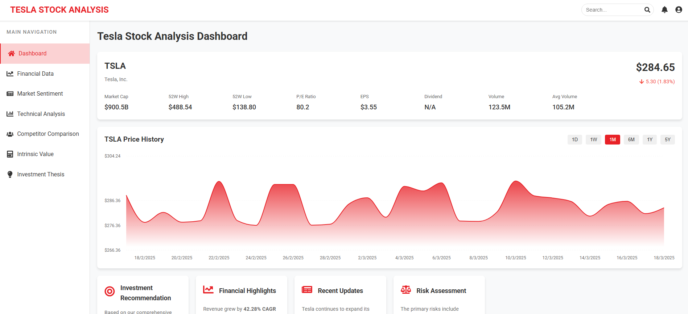
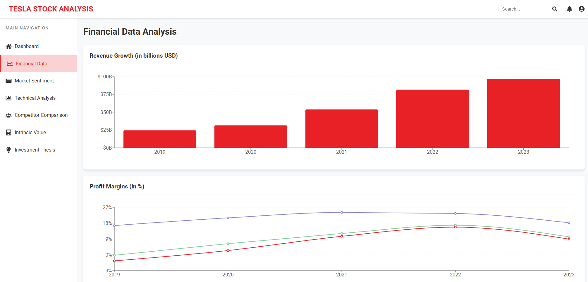
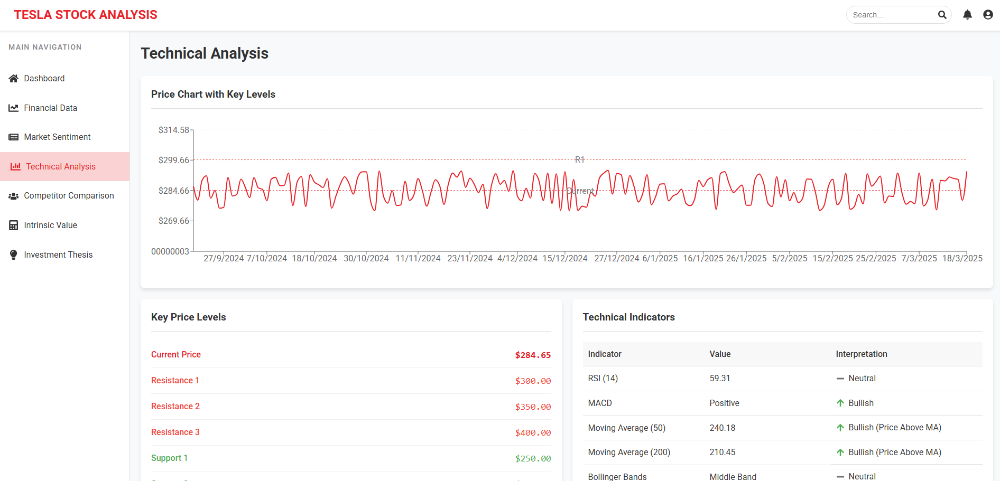

# Tesla Stock Analysis Dashboard


An interactive analysis dashboard providing a comprehensive view of Tesla's market performance and financial outlook.



## 📋 Table of Contents

- [Features](#-features)
- [Demo](#-demo)
- [Technologies Used](#-technologies-used)
- [Installation](#-installation)
- [Usage](#️-usage)
- [Project Structure](#️-project-structure)
- [Included Analysis](#-included-analysis)
- [Data Sources](#-data-sources)
- [License](#-license)
- [Contributors](#contributors)

## ✨ Features

- **Comprehensive Dashboard**: General overview with key performance metrics for Tesla
- **Interactive Visualizations**: Dynamic charts and tables to explore financial data
- **Multidimensional Analysis**: From financial data to technical analysis and market sentiment
- **Responsive Design**: Optimized user experience on mobile and desktop devices
- **Intuitive Interface**: Simple navigation between different analysis sections

## 🚀 Demo

You can see a live version of the analysis dashboard at [Tesla Analysis Dashboard](https://your-dashboard-url.com)

## 💻 Technologies Used

- **React**: Frontend framework for the user interface
- **Recharts**: Data visualization library
- **Styled Components**: CSS-in-JS styling
- **React Router**: Page navigation
- **React Icons**: Expressive iconography

## 📦 Installation

To run this project locally, follow these steps:

```bash
# Clone the repository
git clone https://github.com/JonIbarreche/tesla-stock-analysis.git

# Navigate to the project directory
cd tesla-stock-analysis

# Install dependencies
npm install

# Set the environment variable for compatibility with recent Node.js versions
# On Windows (PowerShell):
$env:NODE_OPTIONS='--openssl-legacy-provider'
# On Linux/MacOS:
export NODE_OPTIONS=--openssl-legacy-provider

# Start the development server
npm start
```

## 🖥️ Usage

Once the application is running, navigate to `http://localhost:3000` in your browser.

The side navigation panel allows you to access the different analysis sections:

- Dashboard: General overview
- Financial Data: Detailed analysis of revenue, margins, and finances
- Market Sentiment: Analysis of sentiment and market trends
- Technical Analysis: Technical indicators and price patterns
- Competitor Comparison: Comparison with sector competitors
- Intrinsic Value: Valuation and fundamental analysis
- Investment Thesis: Investment recommendations based on comprehensive analysis

## 🏗️ Project Structure

```
tesla-stock-analysis/
├── public/               # Static files
├── src/                  # Source code
│   ├── components/       # Reusable components
│   ├── pages/            # Application pages
│   ├── data/             # Simulated data and utilities
│   ├── utils/            # Helper functions
│   ├── assets/           # Static resources
│   ├── context/          # React contexts
│   ├── hooks/            # Custom hooks
│   └── img/              # Images used
└── README.md             # Documentation
```

## 📊 Included Analysis

### Financial Data
Detailed analysis of revenue, profit margins, balance sheet, and cash flow.



### Technical Analysis
Historical price charts, support/resistance levels, and technical indicators.



### Market Sentiment
Evaluation of analyst ratings, price targets, and social media sentiment.

### Competitor Comparison
Comparative analysis of Tesla against other automakers and electric vehicle competitors.

### Intrinsic Value Analysis
Valuation using discounted cash flow (DCF) methodology and valuation multiples.

### Investment Thesis
SWOT analysis, risk assessment, and recommendations for different investor types.

## 📈 Data Sources

Currently, the application uses simulated data for demonstration. In a real implementation, data would be obtained from:

- Financial APIs (Yahoo Finance, Alpha Vantage, etc.)
- Tesla's quarterly and annual reports
- Real-time market data
- Sentiment analysis from news sources and social media

## 📄 License

This project is licensed under the MIT License - see the LICENSE file for details.

## Contributors

- Jon Ibarreche <jon.ibarreche@opendeusto.es>
